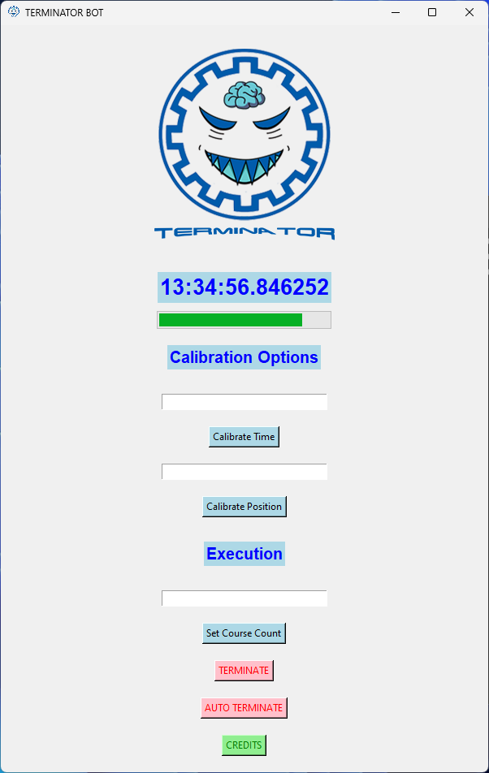

<h1 align = "center">TERMINATOR</h1>

<h2 align="left">  TABLE OF CONTENTS </h2>

- [PROJECT DESCRIPTION](#course-description)
    - [AUTO DETECTION](#course-description)
-   [**MALACIOUS USE**](#caution)
- [CREDITS](#credits)
- [SOFTWARE SNAPSHOTS](#snapshots)

<a href="#course-description">
<h2>  Project Description </h2>
</a>

TERMINATOR has been developed to help specifcally the students of **Sharif University of Technology** with their course selection process.

Ofcourse the source code in **Python** can be modified for other coleeges and universities as well.

> Keep in mind that since this software runs locally on your computer, there is no way for the hosting service to detect the software because no requests are sent directly from the software unlike most tools with the same functionality.

<h3 align = 'center'>Auto Detection</h3>

Auto-Detection tool is also implemented into the software. This tool can be used to automatically detect the button and click it after moving to the next browser tab. This tool has been developed using **Image Processing** in **Python** and runs locally on your computer, so there is no way for the hosting service to detect the software.

 **CAUTION**

> Keep in mind that using this software tool may or may not lead to unwanted consequences. The developer of this tool ***(Amirreza Mirjalily)*** **is not** under any sort of legal or moral obligation for your malacious use of the software.

<a href="#credits">
<h2>  Credits</h2>
</a>

| Name | School | Student ID |
| --- | --- | --- |
| Amirreza Mirjalily | EE Department, SUT | 402102549 |

<h2>  Software Snapshots</h2>

